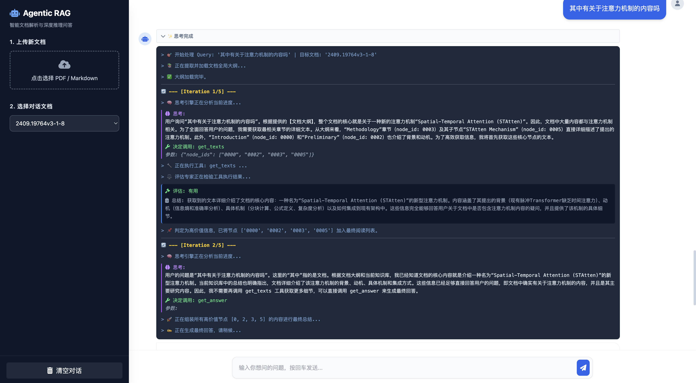
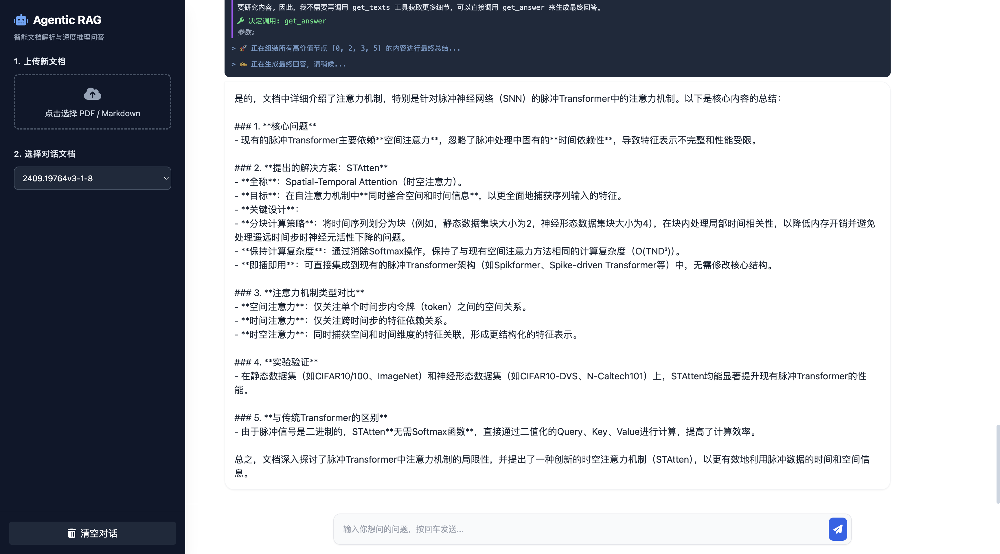
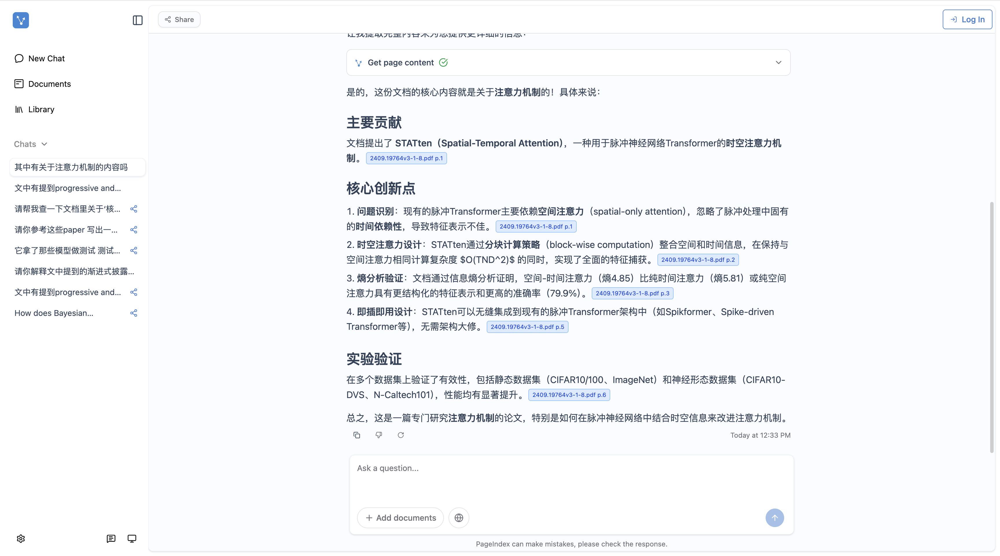

# pageIndex-rag-chat
An Agentic RAG Web UI system built on the ReAct paradigm with PageIndex, visualizing the document retrieval and reasoning process(90% similarity to the original.)
[](/README_zh.md)
[](https://opensource.org/licenses/MIT)

## Compared with the official website




official


## Quick Start
```
dependencies:
pip install -r requirements.txt

start the service
python main.py
```


## ✨ Core Features
- 🚀 **FastAPI-Powered**: The service is built on FastAPI, easily integrable into your own applications
- 🗺️ **TOC-Driven Navigation**: Abandon blind vector matching; the Agent reads the global outline and accurately locates target chapters based on logical relevance
- 🕵️‍♂️ **ReAct Thinking Engine**: Empowers the model with autonomous decision-making capabilities, loading content on demand to significantly reduce Token consumption
- ⚖️ **Dynamic Evaluation & Reflection**: Automatically assesses the validity of extracted text, dynamically builds a high-quality local knowledge base, and filters out irrelevant noise
- 🔌 **Plug & Play Simplicity**: Natively adapts to the `_structure.json` format output by PageIndex, lightweight and ready-to-use, compatible with all OpenAI-compatible APIs

Note: The core PageIndex code in this project has been modified to adapt to OpenAI-compatible interfaces, configured in the .env file (the original project only supports the ChatGPT API)
```text
.env
OPENAI_API_KEY=your_openai_api_key
OPENAI_MODEL=model_name
OPENAI_BASE_URL=base_url
## 🛠️Core Architecture
User Query 
   │
   ▼
[Load Document Outline (TOC)] ──────┐
   │                                 │
   ▼                                 ▼
Thought-Agent ◄──────────────── [Current Knowledge Base]
   │ (Autonomously decide next action)      ▲
   ▼                                       │
Call Tool (get_texts)                      │
   │                                       │
   ▼                                       │
Judge-Agent ───────────────────────────────┘
  (Evaluate result validity and summarize experience)
   │
   ▼ (Triggered when sufficient information is collected)
Call Tool (get_answer) 
   │
   ▼
Generate Final Answer
```
## 📌 Todo List
- [ ] Support multi-document Q&A capabilities
- [ ] Package as MCP interface
- [ ] Integrate database storage capabilities
- [ ] Connect to Ollama/VLLM to achieve full local deployment